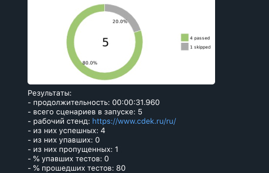

Selenium autotests for Cdek.ru with use Allure and telegram

### Dependencies:

* Java 8
* Selenide 5.17.0
* JUnit 5.7.0
* Aspectj 1.9.5
* Allure-selenide 2.13.7
* Allure plugin 2.8.1

Then run tests with use terminal:

Run local:
* video (boolean true or false)
> gradle test -Dvideo=

Run remote need to pass value:

* remote.driver.url (url address from selenoid or grid)
* remote.driver.user (name user if required for available to selenoid/grid)
* remote.driver.password (password user if required for available to selenoid/grid)
* remote.browser.name (chrome, firefox)
* video (boolean true or false)
* web.threads (number of threads, default 2)

> gradle clean -Dremote.driver.url= -Dremote.driver.user= -Dremote.driver.password= -Dremote.browser.name= -Dvideo= -Dthreads=

Telegram notifications

