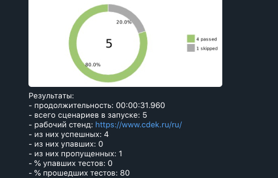

Selenium autotests for Cdek.ru with use Allure and telegram

### Dependencies:

* Java 8
* Selenide 5.17.0
* JUnit 5.7.0
* Aspectj 1.9.5
* Allure-selenide 2.13.7
* Allure plugin 2.8.1

Then run tests with use terminal:
Run local
> gradle test

Run remote (need to pass value remote.driver.url, remote.driver.user, remote.driver.password)
>  gradle clean test -Dremote.driver.url= -Dremote.driver.user= -Dremote.driver.password=

Telegram notifications

