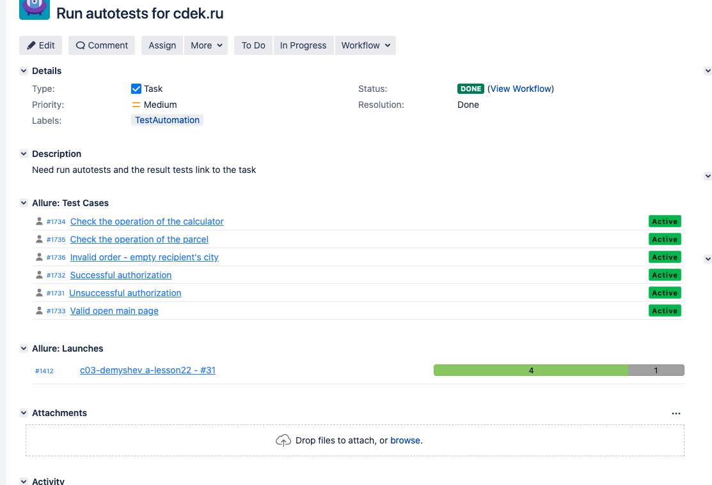

# UI autotests for cdek.ru 

## Technology stack
Java, Gradle, Junit5, Selenide, Allure Report, Allure TestOps, Jenkins, Selenoid, Telegram Bot, Jira.

## Dependencies
* Java 8
* Selenide 5.17.0
* JUnit 5.7.0
* Aspectj 1.9.5
* Owner 1.0.12
* Allure-selenide 2.13.7
* Allure plugin 2.8.1
* Allure TestOps 3.28.2
* Logback 1.2.3

## Run tests with use terminal:

### For run local tests need call command:

> gradle test

### For run remote tests need fill example.properties or to pass value:

* remote.driver.url (url address from selenoid or grid)
* remote.driver.user (name user if required for available to selenoid/grid)
* remote.driver.password (password user if required for available to selenoid/grid)
* remote.browser.name (chrome, firefox)
* video (boolean true or false)
* threads (number of threads, default 2)

> gradle clean -Dremote.driver.url= -Dremote.driver.user= -Dremote.driver.password= -Dremote.browser.name= -Dvideo= -Dthreads=

#### Jenkins

#### Allure report

#### Selenoid video

#### Allure Test Ops

#### Allure Test Ops test cases automation and manual

#### Telegram notifications

#### Integration with Jira
